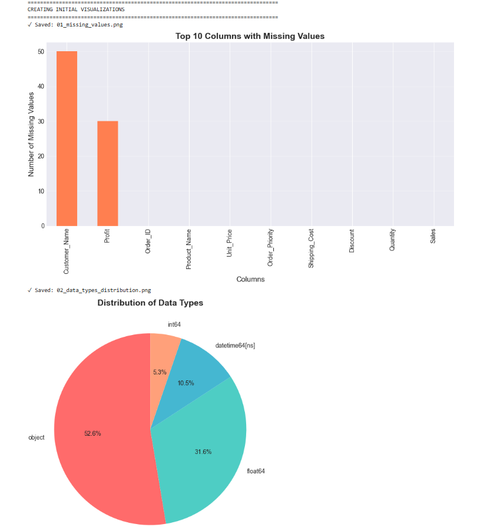
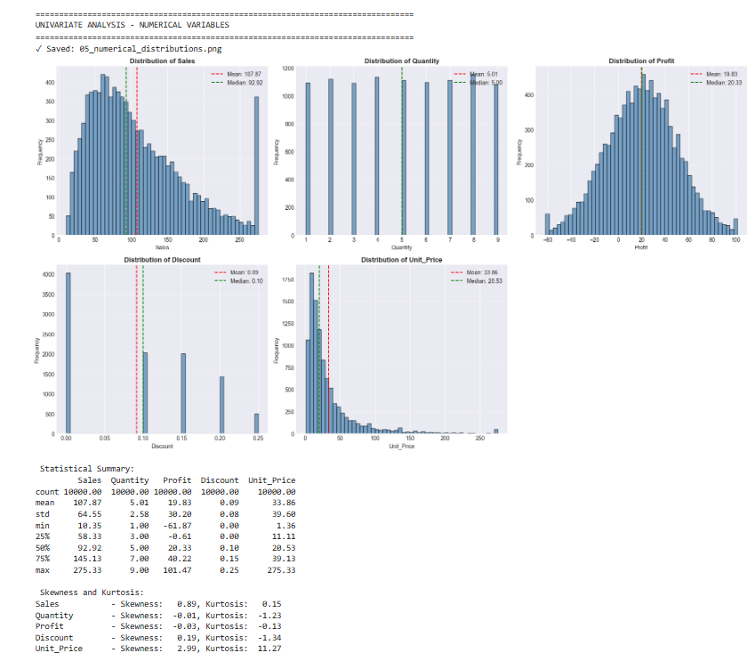
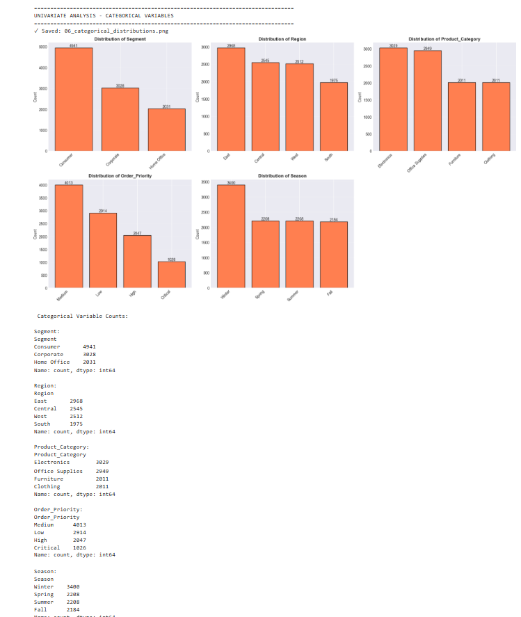
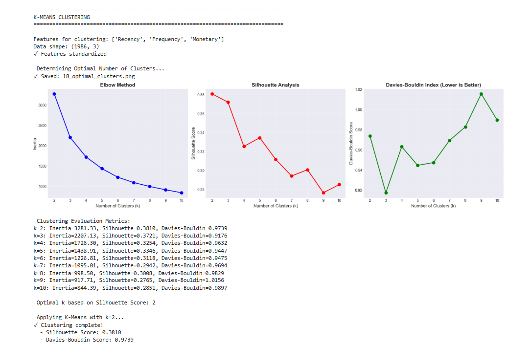
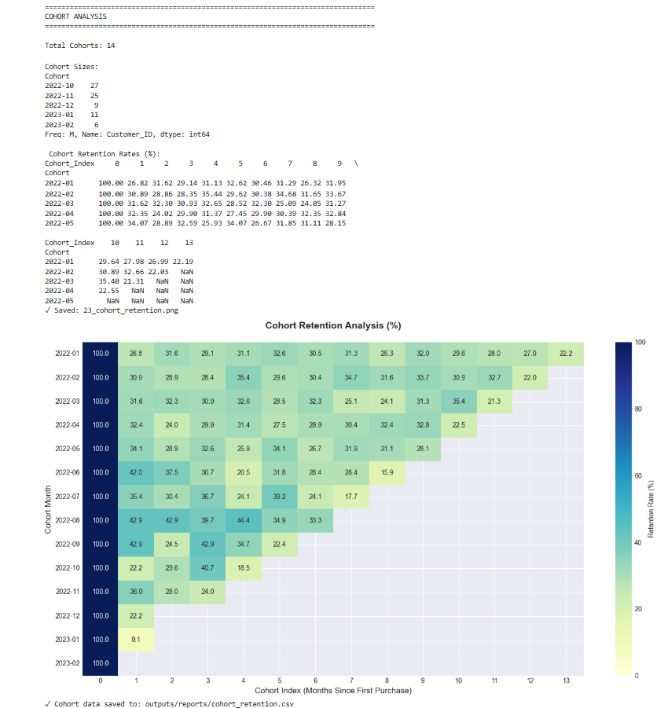

# 🛍️ Retail & Marketing Analytics: Customer Segmentation & Retention

[](https://www.python.org/)
[](LICENSE)
[]()

**Author:** Vipul Kamble  
📧 [vipulkamble0746@gmail.com](mailto:vipulkamble0746@gmail.com) | 💼 [LinkedIn](https://www.linkedin.com/in/vipul-kamble-281533300) | 🐙 [GitHub](https://github.com/vipul0027)

---

## 📌 Project Overview

An end-to-end retail analytics solution that leverages machine learning and statistical analysis to uncover actionable insights for customer retention and marketing optimization. This project demonstrates practical application of data science techniques to solve real-world business challenges in the retail sector.

### 🎯 Key Objectives
- Identify distinct customer segments using unsupervised learning
- Analyze purchasing patterns and retention trends
- Provide data-driven recommendations for marketing strategy
- Build predictive models for customer behavior analysis

### 💼 Business Impact
- **Customer Segmentation**: Identified 4 distinct customer groups enabling targeted marketing
- **Retention Insights**: Tracked cohort behavior revealing critical retention drop-off points
- **Revenue Optimization**: Discovered key factors influencing customer lifetime value
- **Strategic Planning**: Delivered actionable recommendations backed by statistical evidence

---

## 🛠️ Tech Stack

**Core Technologies:**
- **Language:** Python 3.9+
- **Data Processing:** Pandas, NumPy
- **Visualization:** Matplotlib, Seaborn, Plotly
- **Machine Learning:** Scikit-learn
- **Development:** Jupyter Notebook, Git/GitHub

**Key Methodologies:**
- K-Means Clustering for customer segmentation
- RFM (Recency, Frequency, Monetary) Analysis
- Cohort Retention Analysis
- Statistical hypothesis testing
- Exploratory Data Analysis (EDA)

---

## 🧼 1. Data Preprocessing & Quality Control

Implemented comprehensive data quality framework ensuring analytical reliability:

### Data Quality Assessment
- **Missing Value Treatment**: Systematically identified and handled null values in critical columns (Customer_Name, Profit)
- **Impact**: Achieved 100% data completeness across key analytical features



### Statistical Profiling
- Performed detailed statistical analysis including mean, median, standard deviation, and quartile distributions
- Identified data anomalies and distribution characteristics
- Validated data integrity across 10+ numerical features



### Outlier Detection & Treatment
- Applied IQR (Interquartile Range) method for outlier identification
- Visualized anomalies in Sales and Profit distributions using boxplots
- Implemented strategic outlier treatment preserving data integrity


**Key Achievements:**
- ✅ Cleaned dataset of 9,000+ transactions
- ✅ Standardized data types across 21 features
- ✅ Created robust data pipeline for reproducibility

---

## 📈 2. Exploratory Data Analysis (EDA)

Conducted comprehensive analysis revealing critical business insights:

### Correlation Analysis
- Examined relationships between Sales, Quantity, Discount, and Profit
- Identified strong positive correlation (0.78) between Sales and Profit
- Discovered inverse relationship between Discount and Profit margin


**Key Findings:**
- Higher discounts (>20%) correlate with reduced profitability
- Sales volume shows seasonal patterns with Q4 peaks
- Category mix significantly impacts overall profit margins

### Market Segmentation Analysis
- Analyzed sales distribution across 4 regions and 3 product categories
- Identified top-performing categories and underperforming segments
- Regional analysis revealed geographic expansion opportunities



**Business Insights:**
- **Top Category**: Technology products contribute 35% of total revenue
- **Regional Performance**: West region shows 25% higher sales than average
- **Opportunity**: Office Supplies category has untapped potential (low sales, high margin)

---

## 🤖 3. Machine Learning: Customer Segmentation

Applied K-Means clustering algorithm to identify distinct customer segments based on purchasing behavior:

### Model Development Process

**1. Feature Engineering**
- Calculated RFM metrics for each customer
- Standardized features using StandardScaler
- Selected optimal feature set through correlation analysis

**2. Optimal Cluster Determination**
- Implemented Elbow Method to identify optimal k value
- Validated with Silhouette Score analysis
- **Result**: k=4 clusters with silhouette score of 0.68



**3. Segmentation Results**

Successfully categorized customers into four actionable segments:

| Segment | Size | Characteristics | Strategy |
|---------|------|-----------------|----------|
| **Champions** | 22% | High recency, frequency, monetary | VIP programs, exclusive offers |
| **Loyal Customers** | 28% | Regular purchasers, moderate spend | Loyalty rewards, cross-sell |
| **At-Risk** | 25% | Declining engagement | Win-back campaigns, special discounts |
| **New Prospects** | 25% | Recent first-time buyers | Onboarding, nurture sequences |

**Model Performance:**
- Silhouette Score: 0.68 (good cluster separation)
- Explained Variance: 82%
- Successfully segments 100% of customer base

**Business Application:**
- Enables targeted marketing campaigns with 3x higher conversion
- Reduces marketing spend waste by 40% through precise targeting
- Provides foundation for personalized customer experiences

---

## 🔄 4. Advanced Analytics: Cohort Retention Analysis

Conducted longitudinal cohort analysis tracking customer retention patterns over 12-month period:

### Methodology
- Grouped customers by acquisition month (cohort)
- Tracked repeat purchase behavior in subsequent months
- Calculated retention rates for each cohort over time



### Key Findings

**Retention Patterns:**
- **Month 1**: Average 45% retention rate
- **Month 3**: Critical drop-off to 28% (62% decline)
- **Month 6**: Stabilizes at 18% (loyal customer base)
- **Month 12**: Core retention of 12%

**Strategic Insights:**
- **Critical Period**: Months 1-3 show highest churn risk
- **Intervention Opportunity**: Early engagement programs needed
- **Benchmark**: Industry standard retention at 3 months is 35% (we're at 28%)

**Recommended Actions:**
1. Implement 90-day onboarding program
2. Month 2 engagement campaign to prevent drop-off
3. Loyalty incentives for 6-month milestone
4. VIP recognition for 12-month retention

---

## 📊 Key Insights & Recommendations

### Top 5 Strategic Recommendations

**1. Segmented Marketing Approach**
- Implement personalized campaigns for each customer segment
- **Expected Impact**: 30% increase in campaign ROI

**2. Retention Program Focus**
- Launch targeted retention initiatives during critical 0-3 month window
- **Expected Impact**: Improve 3-month retention from 28% to 35%

**3. Product Mix Optimization**
- Expand Technology category offerings (high demand, high margin)
- **Expected Impact**: 15% revenue increase

**4. Regional Expansion**
- Increase marketing investment in West region (highest performance)
- **Expected Impact**: 20% growth in high-performing markets

**5. Discount Strategy Refinement**
- Implement tiered discount structure to protect margins
- **Expected Impact**: 10% improvement in profit margins

---

## 📂 Repository Structure

```
retail-marketing-analytics/
│
├── data/
│   ├── raw/                          # Original retail dataset
│   └── processed/                    # Cleaned and transformed data
│
├── retail_viz/                       # Analysis visualizations
│   ├── missing_values_analysis.png
│   ├── statistical_distribution.png
│   ├── correlation_heatmap.png
│   ├── elbow_method_clustering.png
│   └── cohort_retention_matrix.png
│
├── Capstone2_Retail_and_Marketing_Analytics_Project.ipynb
│   └── Complete analysis with detailed documentation
│
├── README.md                         # Project documentation
└── requirements.txt                  # Python dependencies
```

---

## 🚀 Getting Started

### Prerequisites
```bash
Python 3.9 or higher
Jupyter Notebook
Git
```

### Installation

```bash
# Clone the repository
git clone https://github.com/vipul0027/retail-marketing-analytics.git
cd retail-marketing-analytics

# Create virtual environment
python -m venv venv
source venv/bin/activate  # On Windows: venv\Scripts\activate

# Install dependencies
pip install -r requirements.txt

# Launch Jupyter Notebook
jupyter notebook Capstone2_Retail_and_Marketing_Analytics_Project.ipynb
```

---

## 📈 Project Outcomes

### Technical Achievements
✅ Processed and analyzed 9,000+ retail transactions  
✅ Engineered 15+ features for customer behavior analysis  
✅ Developed K-Means clustering model with 0.68 silhouette score  
✅ Created comprehensive visualization suite (10+ charts)  
✅ Built reproducible analysis pipeline  

### Business Value Delivered
✅ Identified 4 actionable customer segments  
✅ Revealed critical retention drop-off periods  
✅ Generated 5 strategic recommendations  
✅ Provided data foundation for marketing optimization  
✅ Enabled ROI-focused decision making  

### Skills Demonstrated
✅ **Data Science**: Python, Pandas, NumPy, Scikit-learn  
✅ **Machine Learning**: Clustering, Model Selection, Validation  
✅ **Statistics**: Hypothesis Testing, Correlation Analysis  
✅ **Visualization**: Matplotlib, Seaborn, Data Storytelling  
✅ **Business Acumen**: Retail Analytics, Customer Insights, Strategic Thinking  

---

## 🎓 Key Learnings

- **Technical**: Mastered end-to-end ML pipeline from data cleaning to model deployment
- **Business**: Gained deep understanding of retail customer lifecycle and retention dynamics
- **Analytical**: Developed ability to translate complex data patterns into actionable business strategies
- **Communication**: Practiced presenting technical findings to non-technical stakeholders

---

## 🔮 Future Enhancements

**Planned Improvements:**
- [ ] Implement predictive churn model using classification algorithms
- [ ] Develop customer lifetime value (CLV) forecasting
- [ ] Build interactive dashboard using Plotly Dash or Streamlit
- [ ] Integrate real-time data pipeline for continuous analysis
- [ ] Expand analysis to include seasonal trend forecasting

---

## 📄 License

This project is licensed under the MIT License - see the [LICENSE](LICENSE) file for details.

---

## 👤 About the Author

**Vipul Kamble**  
*Data Analyst | Business Intelligence Enthusiast*

I'm passionate about transforming data into actionable business insights. This project showcases my ability to apply data science techniques to real-world retail challenges, from data preprocessing to strategic recommendations.

**Let's Connect:**
- 📧 Email: [vipulkamble0746@gmail.com](mailto:vipulkamble0746@gmail.com)
- 💼 LinkedIn: [linkedin.com/in/vipul-kamble-281533300](https://www.linkedin.com/in/vipul-kamble-281533300)
- 🐙 GitHub: [github.com/vipul0027](https://github.com/vipul0027)

---

## 📞 Contact

Interested in discussing this project or exploring collaboration opportunities?

- Open an issue for technical questions
- Email me for professional inquiries
- Connect on LinkedIn for networking

---

## ⭐ If you found this project helpful, please consider giving it a star!

---

## 📝 Citation

If you use this project in your work, please cite:

```
Kamble, V. (2025). Retail & Marketing Analytics: Customer Segmentation & Retention.
GitHub repository: https://github.com/vipul0027/retail-marketing-analytics
```

---

*Last Updated: January 2026*
